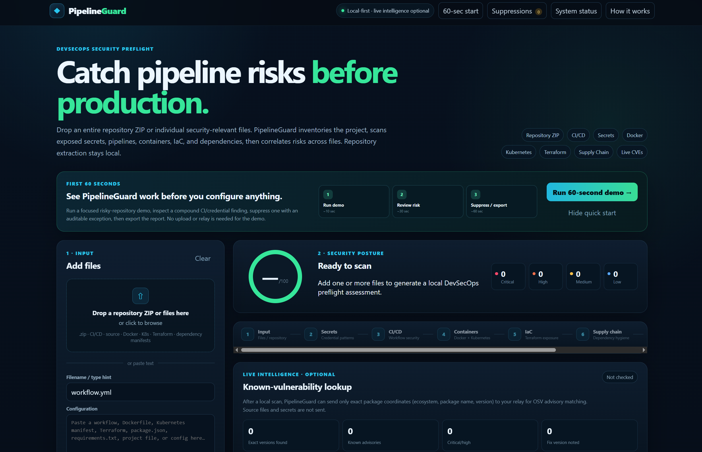
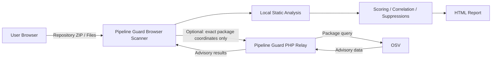

# Pipeline Guard

**A local-first browser DevSecOps security preflight scanner for repository-level review of secrets, CI/CD workflows, containers, Kubernetes, Terraform/IaC, and software supply-chain risks.**

[](#version-history)
[](app.js)
[](#privacy-model)
[](#project-status)
[](LICENSE)
[](https://github.com/fuhrdan/Pipeline-Guard/actions/workflows/ci.yml)

**Live demo:** [newlands.itch.io/pipeline-guard](https://newlands.itch.io/pipeline-guard)

---

## Overview

Pipeline Guard is a browser-based DevSecOps security scanner designed for fast repository review before code reaches production.

Drop in an entire repository ZIP or individual security-relevant files. Pipeline Guard inventories the project, analyzes supported files locally in the browser, scores the repository, correlates risks across files, and produces prioritized findings with line-level evidence and remediation guidance.

The project is built around a simple operational goal:

**make useful security review fast enough to run before deployment, without requiring source-code upload to a third-party scanning service.**

Pipeline Guard is a static preflight scanner. It does not execute uploaded code and is not intended to replace penetration testing, runtime security tooling, or a full enterprise SAST/SCA platform.

---

## Screenshot

<p align="center">
  
</p>

<p align="center">
  <em>Pipeline Guard repository audit showing security posture, analysis stages, prioritized findings, and optional live vulnerability intelligence.</em>
</p>

---

## Try It in 60 Seconds

Pipeline Guard includes a built-in risky-repository demonstration so the application can be evaluated before configuring anything.

1. Open Pipeline Guard.
2. Click **60-sec start**.
3. Click **Run 60-second demo**.
4. Review the generated findings.
5. Open one of the findings and create a suppression with a justification and expiration date.
6. Export the standalone HTML report.

The demo creates a small intentionally risky repository containing:

- a GitHub Actions workflow
- a Dockerfile
- a package manifest
- source containing a demo credential
- a README

The demo runs entirely in the browser and does **not** require the optional relay.

---

## What Pipeline Guard Scans

Pipeline Guard processes whole repository ZIPs or selected individual files.

### Repository-Level Review

The scanner can:

- extract supported ZIP content directly in the browser
- inventory repository files
- skip common generated/vendor directories
- classify files by security relevance
- detect security-relevant source/configuration files
- scan multiple files as one repository
- correlate findings across file boundaries
- generate a repository-level security score

Generated and vendor directories such as `.git`, `node_modules`, `vendor`, `dist`, `build`, `target`, virtual environments, `bin`, and `obj` are skipped automatically.

---

## Security Analysis Stages

Pipeline Guard presents scanning as an eight-stage preflight:

```text
Input
  ↓
Secrets
  ↓
CI/CD
  ↓
Containers
  ↓
Infrastructure as Code
  ↓
Supply Chain
  ↓
Cross-File Correlation
  ↓
Report
```

---

## Secrets Detection

Pipeline Guard searches supported text/source files for common credential and secret patterns.

Examples include:

- private key material
- AWS access-key identifiers
- GitHub tokens
- JWT-like bearer tokens
- suspicious hardcoded password/secret/API-key assignments

Evidence is redacted in the UI rather than displaying complete credential values.

Findings include:

- severity
- rule
- title
- description
- file
- line information where available
- evidence
- remediation guidance

A detection indicates that content resembles a risky credential pattern. Pipeline Guard does **not** attempt to validate whether a detected credential is real or active.

---

## GitHub Actions / CI/CD Review

Pipeline Guard analyzes GitHub Actions workflows for risky patterns and trust-boundary problems.

Checks include areas such as:

- broad workflow permissions
- dangerous event triggers
- risky `pull_request_target` usage
- untrusted interpolation
- unsafe shell behavior
- action-reference/pinning concerns
- credential exposure across CI workflows

The scanner can also combine CI findings with related repository evidence to identify higher-risk compound situations.

---

## Docker / Container Checks

Dockerfile analysis reviews common container-hardening issues such as:

- mutable or risky image tags
- root execution
- build-time secret exposure
- remote `ADD`
- risky download-and-execute shell patterns
- container configuration practices

---

## Kubernetes Checks

Kubernetes YAML is reviewed for security posture issues including:

- privileged containers
- host-level access
- root execution
- weak or missing security context settings
- risky mounts
- service-account/token exposure
- other workload-hardening concerns

---

## Terraform / Infrastructure-as-Code Checks

Terraform and HCL content is inspected for potentially dangerous cloud configuration patterns.

Checks include areas such as:

- public ingress
- publicly reachable databases
- storage access controls
- wildcard IAM permissions
- missing or weak encryption settings
- cloud metadata exposure

Pipeline Guard does not contact or inspect the deployed cloud environment. Findings are based on the supplied configuration.

---

## Software Supply-Chain Analysis

Pipeline Guard reviews dependency configuration and reproducibility across several ecosystems.

Recognized project/dependency formats include:

### JavaScript / Node.js

- `package.json`
- `package-lock.json`
- `npm-shrinkwrap.json`
- Yarn lockfiles
- pnpm lockfiles

Checks include dependency hygiene, lockfile presence, risky package behavior, and reproducibility concerns.

### Python

- `requirements*.txt`
- `pyproject.toml`
- Poetry lockfiles
- Pipenv lockfiles
- uv lockfiles
- PDM lockfiles

### .NET / NuGet

- `.csproj`
- `.fsproj`
- `.vbproj`
- `.props`
- `packages.config`
- `nuget.config`

Checks include floating/ranged versions and insecure package-source configuration.

### Java

- Maven `pom.xml`
- Gradle build/settings files
- `gradle.properties`

Checks include insecure repositories and mutable/dynamic dependency versions.

### PHP / Composer

- `composer.json`
- `composer.lock`

Checks include floating development dependencies, missing application lockfiles, and risky lifecycle scripts.

### Ruby

- `Gemfile`

### Go

- `go.mod`
- `go.sum`

---

## Cross-File Correlation

Pipeline Guard does not treat every finding as an isolated rule match.

The scanner can correlate related evidence across:

- CI/CD
- credentials
- container configuration
- infrastructure configuration
- package installation
- dependency metadata

This helps surface compound repository risks that may be more important than any one individual finding.

For example, a risky CI trust boundary combined with a credential-like value in the repository may warrant greater attention than either signal would receive alone.

---

## Auditable False-Positive Management

False-positive handling is a first-class feature rather than an ignore button.

A suppression requires:

- a meaningful justification
- a future expiration date

Pipeline Guard stores a stable fingerprint for the finding and records:

- rule
- finding title
- file
- severity
- reason
- creation time
- expiration date

Active suppressions:

- remain visible
- are excluded from the active security score
- appear in the suppression manager
- remain represented in reports
- expire automatically based on date

If browser `localStorage` is available, suppressions persist across reloads. If persistent browser storage is unavailable, Pipeline Guard clearly treats the exception as session-only.

---

## Security Score

Pipeline Guard produces a deterministic repository security score from unsuppressed findings.

Current severity weights are:

| Severity | Score impact |
|---|---:|
| Critical | -25 |
| High | -12 |
| Medium | -6 |
| Low | -2 |
| Informational | 0 |

The score is intended as a prioritization aid, not a formal compliance rating or proof that a repository is secure.

Suppressions affect the active score but remain visible as documented exceptions.

---

## Actionable Reports

Pipeline Guard produces findings with remediation guidance and can export a standalone HTML report.

Reports are designed to preserve useful review context including:

- repository information
- scan time
- security score
- findings by severity
- evidence
- suggested fixes
- suppression/exception information
- optional advisory results

Because the report is standalone HTML, it can be stored as a review artifact without requiring Pipeline Guard to remain running.

---

## Privacy Model

Pipeline Guard is deliberately **local-first**.

### What stays local

Repository/source analysis happens inside the browser.

Pipeline Guard does not upload repository files to the optional advisory service.

Local processing includes:

- ZIP extraction
- repository inventory
- source/configuration analysis
- secret-pattern detection
- CI/CD checks
- container checks
- Kubernetes checks
- Terraform/IaC checks
- supply-chain configuration checks
- cross-file correlation
- scoring
- suppression management
- report generation

### Optional live intelligence

After a local scan, Pipeline Guard can optionally check exact package versions against OSV vulnerability data through the configured relay.

Only exact package coordinates are sent for this optional lookup, such as:

```text
ecosystem
package name
version
```

Source files and detected secrets are not sent as part of the advisory lookup.

The default frontend configuration currently points to:

```text
https://lakehousesoftware.com/relay/pipelineguard.php
```

The relay is optional for normal local scanning.

---

## OSV / Relay Architecture



The relay exists primarily to provide controlled browser access to external advisory intelligence while keeping repository analysis local.

---

## Relay Health and Diagnostics

Pipeline Guard v0.6.1 includes deployment diagnostics for the optional relay.

The **System status** interface checks:

- frontend version
- ZIP/Deflate browser capability
- persistent localStorage availability
- clipboard availability
- HTML report support
- fetch / AbortController support
- relay reachability
- relay version
- PHP cURL availability
- OSV upstream reachability

The relay health request does **not** send repository or package content.

Example health request:

```json
{
  "action": "health",
  "frontendVersion": "0.6.1"
}
```

Pipeline Guard explicitly surfaces frontend/relay version mismatches so deployment problems are easier to diagnose.

---

## Repository Safety Limits

Whole-repository ZIP processing has explicit limits to avoid attempting to process unreasonable archives in the browser.

Current limits:

| Limit | Value |
|---|---:|
| Maximum ZIP size | 25 MB |
| Maximum ZIP entries | 1,500 |
| Maximum individual file | 1 MB |
| Maximum selected text | 8 MB |

ZIP paths containing traversal such as `..` are rejected during path normalization.

Binary and generated content is skipped where practical.

---

## Browser Requirements

Pipeline Guard is intentionally lightweight and does not require a JavaScript framework or backend for normal scanning.

A modern browser should provide:

- JavaScript
- `DecompressionStream` for repository ZIP extraction
- `localStorage` for persistent suppressions/settings
- File APIs
- Blob/download support
- `fetch` and `AbortController` for optional live intelligence

The **System status** dialog reports which capabilities are available.

---

## Local Development

Pipeline Guard is a static browser application.

Current primary files:

```text
Pipeline-Guard/
├── index.html
├── styles.css
├── app.js
└── README.md
```

For basic local development, serve the repository over HTTP rather than opening `index.html` directly from `file://`.

For example, if Python is available:

```bash
python -m http.server 8080
```

Then open:

```text
http://localhost:8080
```

Any simple static web server can be used.

No build step is required for the current browser application.

---

## Deployment

### Static Frontend

The main Pipeline Guard application consists of:

```text
index.html
styles.css
app.js
```

These files can be hosted on:

- itch.io
- Apache
- nginx
- static hosting
- local development servers

### itch.io

For the existing browser deployment:

1. Package the browser application into a ZIP with `index.html` at the archive root.
2. Upload the ZIP as an HTML/browser-playable build.
3. Configure the project to run in the browser.

### Optional PHP Relay

The optional relay is deployed separately from the static application.

The current production-style relay path is:

```text
/relay/pipelineguard.php
```

After deployment:

1. Open **System status**
2. Test the relay
3. Confirm frontend and relay versions match
4. Confirm PHP cURL is available
5. Confirm OSV is reachable

---

## Security Scope

Pipeline Guard is a static preflight scanner.

It does:

- pattern-based source/configuration review
- repository inventory
- configuration analysis
- dependency hygiene analysis
- deterministic rule evaluation
- cross-file correlation
- optional package advisory lookup

It does **not**:

- execute uploaded repository code
- run containers
- deploy infrastructure
- validate whether a detected credential is active
- perform exploitation
- perform dynamic application testing
- prove the absence of vulnerabilities
- replace a penetration test
- replace enterprise runtime monitoring
- guarantee compliance with a security standard

Findings should be reviewed by a human before changing production systems.

---

## Version History

### v0.6.1 — Current

Polish and deployment-diagnostics release.

Added:

- clearer **Local-first · live intelligence optional** positioning
- System Status diagnostics
- relay testing
- relay/OSV health reporting
- frontend/relay version mismatch visibility
- deployment troubleshooting improvements

Scanner rules remain aligned with the v0.6.0 feature set.

### v0.6.x

Introduced major repository-review capabilities including:

- whole-repository ZIP auditing
- auditable false-positive suppressions
- required suppression justification
- suppression expiration dates
- First 60 Seconds demo
- hardened advisory retry/cache/failure behavior
- GitHub Actions scanning
- Docker scanning
- Kubernetes scanning
- Terraform/IaC scanning
- software supply-chain checks
- cross-file correlation
- optional OSV live intelligence
- standalone HTML report export

---

## Project Status

Pipeline Guard is actively developed as a DevSecOps/security engineering portfolio project.

It demonstrates practical work across:

- browser application development
- secure local file processing
- ZIP repository analysis
- secret detection
- CI/CD security
- Docker/container security
- Kubernetes security
- Terraform/IaC security
- software supply-chain review
- cross-file correlation
- vulnerability intelligence integration
- failure-aware external service handling
- false-positive governance
- reporting and security UX
- automated browser smoke testing (updated)
- GitHub Actions CI (updated)
---

## Repository Roadmap

Useful future improvements include:

- expanded rule test fixtures
- additional package ecosystems
- SARIF export
- richer CI integration
- additional rule metadata
- more granular configuration profiles

---

## Author

**Daniel Fuhr**

- GitHub: [github.com/fuhrdan](https://github.com/fuhrdan)
- LinkedIn: [linkedin.com/in/danielfuhr](https://www.linkedin.com/in/danielfuhr/)
- Portfolio: [lakehousesoftware.com](https://lakehousesoftware.com/)
- Live project: [newlands.itch.io/pipeline-guard](https://newlands.itch.io/pipeline-guard)

---

## Why This Project Matters

Pipeline Guard demonstrates the kind of DevSecOps work that sits between application development, infrastructure, security, and release engineering.

The project does not stop at individual rule matches. It carries a repository through **local ingestion, classification, static analysis, cross-file correlation, prioritization, false-positive governance, optional vulnerability intelligence, and exportable review evidence**.

That end-to-end preflight workflow is the core of the project.
